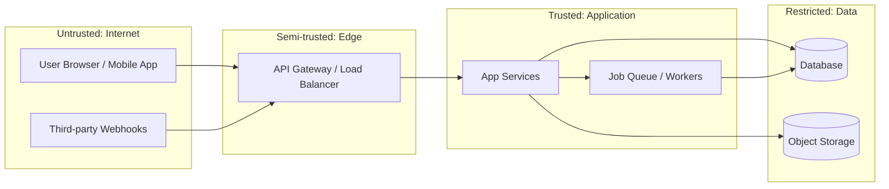

# 08-security-model.md

**Application Threat Model & Security Architecture**

> **Audience:** Developers, Security Engineers, Claude Code, `@security-boss`
> **Authority:** Master Source-of-Truth (Tier 2)
> **Purpose:** Define the application's trust boundaries, data classification, threat model, and security controls

---

## 1. Purpose of This Document

This document is the **application threat model** — the single place where "what can go wrong, where, and what we do about it" is written down. `@security-boss` appends threat models here; `/security-review` reads it before reviewing changes.

It answers:
* Where are the trust boundaries, and what crosses them?
* What data do we hold, and how sensitive is it?
* What are the credible threats per boundary, and which controls counter them?
* How are identity (authn) and permission (authz) decided?
* How are secrets stored, rotated, and kept out of code and logs?

This document does NOT cover:
* Auth implementation detail (see `03-security-auth-and-access.md` — this doc holds the *model*, 03 holds the mechanics)
* Agent/tooling command safety (see §8 — one paragraph, deliberately)

---

## 2. Trust Boundaries

<!-- Replace with the real system diagram. Every arrow that crosses a boundary line is an attack surface and needs a row in §4. -->

| # | Boundary | What crosses it | Trust change |
|---|----------|-----------------|--------------|
| B1 | Internet → Edge | User requests, webhook payloads | Untrusted → validated |
| B2 | Edge → App | Authenticated requests | Validated → authorized |
| B3 | App → Data | Queries, file writes | Authorized → least-privilege service account |
| B4 | App → Third parties | Outbound API calls, payment providers | Trusted → external (data leaves us) |

---

## 3. Data Classification

<!-- Inventory every category of data the system stores or transits. Special categories carry statutory obligations (POPIA §26–35, GDPR Art. 8/9) — if a row applies, it changes consent, retention, and breach-notification duties. -->

| Class | Examples | Storage | At rest | In transit | Retention |
|-------|----------|---------|---------|------------|-----------|
| Public | Marketing pages, docs | Anywhere | — | TLS | Indefinite |
| Internal | Logs (redacted), metrics | App infra | Provider default | TLS | e.g. 90 days |
| Confidential | User PII (name, email, phone) | Primary DB | Encrypted | TLS | Account lifetime + statutory |
| Restricted | Credentials, tokens, payment data | Secrets manager / PCI provider | Encrypted + access-controlled | TLS + pinning where possible | Minimum necessary |
| **Special: children's data** | Any data of users under 18 (POPIA) / under 16 (GDPR) | <!-- where, if applicable --> | Encrypted | TLS | Parental-consent-bound; deletable on request |
| **Special: health data** | Medical, biometric, health-adjacent signals | <!-- where, if applicable --> | Encrypted | TLS | Explicit-consent-bound; minimum necessary |

If a special category applies, name the lawful basis and consent flow here, and see the privacy pointer in §7.

---

## 4. Threats per Boundary (STRIDE-lite)

<!-- One row per boundary from §2. Keep it to threats that are credible for THIS system; a threat with no plausible actor is noise. Every "Control" must name something real (middleware, config, service), not an aspiration. -->

| Boundary | Spoofing | Tampering | Info disclosure | Denial of service | Elevation of privilege |
|----------|----------|-----------|-----------------|-------------------|------------------------|
| B1 Internet→Edge | Credential stuffing → rate-limit + MFA | Payload manipulation → schema validation | Enumeration → uniform errors | Volumetric → WAF/rate-limit | — |
| B2 Edge→App | Forged session → signed tokens, short expiry | Parameter tampering → server-side validation | Verbose errors → sanitized responses | Expensive endpoints → per-user quotas | IDOR / missing authz → ownership check per resource |
| B3 App→Data | — | SQL/NoSQL injection → parameterized queries | Over-broad queries → least-privilege DB roles | Runaway queries → timeouts | Shared service account → per-service credentials |
| B4 App→3rd party | Webhook spoofing → signature verification | Response tampering → TLS + schema check | PII over-sharing → field allowlists | Provider outage → timeouts, circuit breaker | — |

Repudiation is handled system-wide: security-relevant events (login, permission change, payment, deletion) are logged with actor + correlation ID (see `rules/observability.md`).

---

## 5. Authentication & Authorization Model

<!-- The model, not the implementation (mechanics live in 03). -->

**Authentication (who you are):**
* Identity provider / mechanism: <!-- e.g. OIDC via provider X, session cookies, JWT -->
* Session/token lifetime and rotation: <!-- values -->
* MFA policy: <!-- required for whom -->

**Authorization (what you may do):**
* Model: <!-- RBAC / ABAC / ownership-based; enumerate roles -->
* **Checked server-side on every resource access** — authentication passing never implies authorization; never trust a client-supplied role, tenant, or object ID.
* Object-level checks (anti-IDOR): every fetch-by-ID verifies ownership/tenancy.
* Function-level checks: privileged actions verify role at the handler, not at the router.

---

## 6. Secrets Handling

* Secrets live in <!-- secrets manager / env store -->, never in code, config files in git, URLs, or logs.
* Rotation policy: <!-- cadence + on-departure/on-leak procedure -->
* Local development uses `.env` files that are gitignored; `security_secrets.py` (bound to `@security-boss` writes) scans advisorily for committed secrets.
* CI secrets are scoped per-pipeline with minimum permissions.

---

## 7. Data Privacy

Statutory privacy obligations (lawful basis, consent, data-subject rights, cross-border transfer, breach notification) are governed by **`rules/privacy.md` — POPIA/GDPR**. This threat model records *where* regulated data lives (§3); the privacy rule governs *how* it must be treated.

---

## 8. Agent Operations Safety

Safety of the AI agents operating on this codebase (command blocking, destructive-operation guards, path protections) is not part of the application threat model — it is handled by the `/damage-control` skill's blocking hooks plus the advisory hooks in `.claude/hooks/` (see `rules/hooks.md`). Keep that concern there; this document stays about the application and its users.

---

## 9. Review Triggers

Update this document when: a new external integration or webhook is added (new B4 row), a new data category is collected (new §3 row), the authz model changes, or `/security-review` / `@security-boss` finds a threat not represented here. Extend — don't rewrite silently; supersede rows with a dated note.

## 10. See Also

- `03-security-auth-and-access.md` — auth mechanics and access control implementation
- `rules/security.md` — when to invoke `@security-boss`; authn-vs-authz floor
- `rules/privacy.md` — POPIA/GDPR obligations
- `rules/observability.md` — no PII/secrets in logs; audit logging
